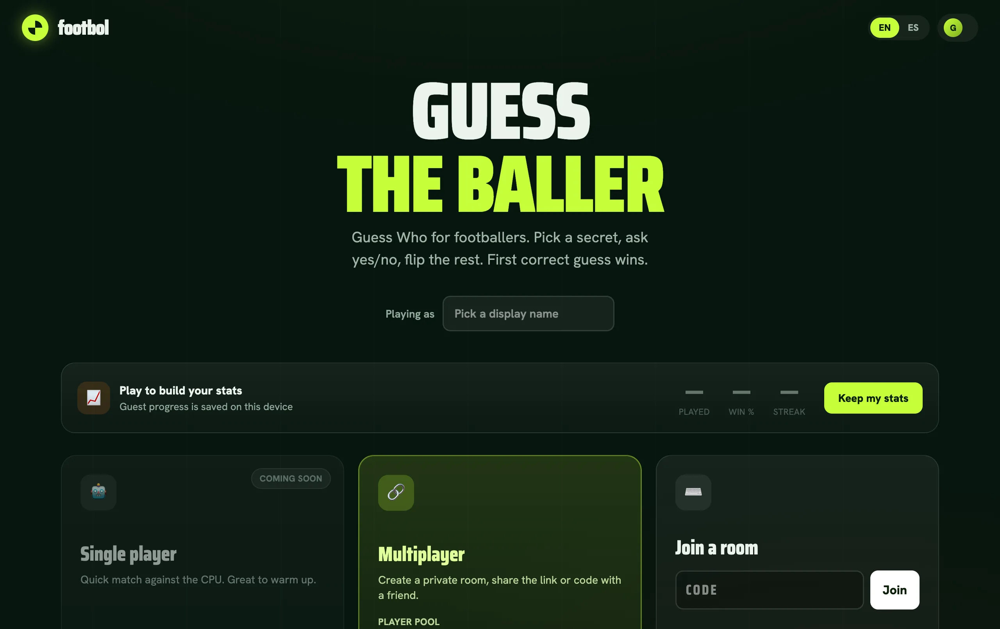

<div align="center">


# footbol

**Guess Who — football edition.** Real-time, two-player "¿Quién es quién?" for footballers, on the Cloudflare edge.

[](https://github.com/ARKye03/footbol/actions/workflows/ci.yml)


</div>

<div align="center">
<picture>
  <source srcset=".github/assets/screenshot.avif" type="image/avif" />
  
</picture>
</div>

---

Pick a secret footballer, ask your opponent yes/no questions, flip away the cards that don't match, and be the first to guess who they are. Two players, one private room, live over WebSockets.

> [!NOTE]
> The MVP runs end-to-end **locally**. Cloudflare deploy + production data seed are deferred until cloud credentials are wired up. See [Status](#status).

## Features

- **Real-time multiplayer** — one Durable Object per room owns the authoritative game state; WebSocket hibernation keeps idle rooms near-free. State syncs live between both clients, secrets stripped per-socket so nobody can peek.
- **Advanced match rules** — beyond plain win/lose: a first-mover **equalizer**, a one-sided **penalty phase** after a wrong guess, and genuine **draws**. Fully specified in [`docs/11`](docs/11-game-rules.md), implemented as a pure, unit-tested state machine.
- **Zero-friction entry** — anonymous guests via Better Auth; share a 4-character room code or a link, no signup. Upgrade to a real account later with one identity model.
- **Real player catalog** — footballers pulled from API-Football into D1, headshots mirrored to R2. Ships with offline sample fixtures (generated SVG avatars) so it runs with no API key.
- **Bilingual** — English / Spanish via Paraglide (compile-time messages, no runtime cost).
- **Dark FUT-style UI** — Svelte 5 runes throughout, Tailwind v4.

## How it plays

Each player is privately assigned a secret footballer from a shared board. On your turn you **ask** one yes/no question, your opponent **answers**, then you **act** — guess, or pass. Flip cards to eliminate candidates anytime.

The match flow is asymmetric on purpose, to make turn order fair:

| Situation                   | Outcome                                                                                           |
| --------------------------- | ------------------------------------------------------------------------------------------------- |
| Second player guesses right | **Wins immediately**                                                                              |
| Starter guesses right       | Opens the **equalizer** — second player gets one guess to force a draw                            |
| Anyone guesses wrong        | Guesser is out; opponent enters the **penalty phase** (default 5 questions) to win, else **draw** |

Full spec — every phase, every ending, edge cases — in [`docs/11-game-rules.md`](docs/11-game-rules.md).

## Architecture

Everything runs as **one Cloudflare Worker**. SvelteKit serves pages, API routes, and assets; a thin custom entry (`src/worker.ts`) peels off WebSocket upgrades and hands them to the room's Durable Object.

```
  Browser A ─┐                  ┌─────────────────────────────┐
             ├── HTTPS / WSS ──▶│  Cloudflare Worker           │
  Browser B ─┘                  │   /ws/<code> → GAME_ROOM DO  │──▶ Durable Object
                                │   else       → SvelteKit      │     (1 per room,
                                └──────────────┬───────────────┘      live state)
                                               │
                            ┌──────────────────┼──────────────────┐
                            ▼                   ▼                  ▼
                          D1 (catalog        R2 (headshots)    KV (pool cache,
                           + history)                            optional)
```

| Concern         | Choice                                                    |
| --------------- | --------------------------------------------------------- |
| App framework   | SvelteKit + Svelte 5 runes                                |
| Hosting         | Cloudflare Workers (`adapter-cloudflare`, workers target) |
| Live state      | Durable Objects + WebSocket Hibernation                   |
| Relational data | D1 (SQLite) + Drizzle ORM                                 |
| Images          | R2                                                        |
| Identity        | Better Auth (`anonymous` plugin)                          |
| i18n            | Paraglide (EN/ES)                                         |
| Game rules      | Pure, framework-free `src/lib/game/rules.ts`              |

Deep dives live in [`docs/`](docs/README.md) — start with [`01-architecture.md`](docs/01-architecture.md).

> [!IMPORTANT]
> `adapter-cloudflare` v7 overwrites whatever `main` points at, so the build uses a **separate `wrangler.adapter.jsonc`** (emits `.svelte-kit/cloudflare/_worker.js`) while `wrangler.jsonc` (`main: ./src/worker.ts` + bindings) drives dev/deploy. See [`docs/01`](docs/01-architecture.md) for the seam.

## Getting started

> [!NOTE]
> Package manager is **pnpm**. Requires Node 22+.

```sh
pnpm install
cp .env.example .env             # drizzle-kit: CLOUDFLARE_* + D1 token (remote ops only)
cp .dev.vars.example .dev.vars   # runtime secrets: BETTER_AUTH_SECRET, ORIGIN, API_FOOTBALL_KEY
pnpm db:migrate:local            # apply schema to local D1
pnpm seed:local                  # load sample footballers + headshots into local D1/R2
pnpm dev                         # vite dev — UI work, real local D1/R2
```

Open http://localhost:5173.

### Two development modes

footbol has a real WebSocket backend, so local dev comes in two flavors ([`docs/07`](docs/07-local-development.md)):

| Command         | Mode                          | Use it for                                                    |
| --------------- | ----------------------------- | ------------------------------------------------------------- |
| `pnpm dev`      | `vite dev` (platformProxy)    | Fast UI iteration. Real local D1/R2, **no live multiplayer**. |
| `pnpm dev:full` | `vite build` + `wrangler dev` | Real Durable Object — open two windows for live 2-player.     |

## Commands

```sh
pnpm dev          # vite dev server
pnpm dev:full     # build + wrangler dev — real Durable Object multiplayer
pnpm build        # wrangler types --check, then vite build
pnpm check        # types + svelte-kit sync + svelte-check
pnpm lint         # prettier --check + eslint
pnpm format       # prettier --write

pnpm test         # all vitest projects once (server + client)
pnpm smoke:ws     # two-client WebSocket protocol smoke test (needs dev:full running)
pnpm e2e          # build + two-context Playwright happy-path

pnpm db:migrate:local   # apply migrations to local D1 (no creds)
pnpm seed:local         # seed sample footballers + headshots
pnpm sync:local         # pull real players from API-Football (needs API_FOOTBALL_KEY)
pnpm gen                # regenerate worker-configuration.d.ts (Env type)
```

## Testing

Two Vitest projects ([`docs/08`](docs/08-testing.md)): **server** (node) for the rules state machine, protocol, and board; **client** (Playwright/chromium) for components. The pure `rules.ts` is exhaustively unit-tested — every guard, both penalty endings, both equalizer endings, draws, forfeit/disconnect. Plus a raw WebSocket protocol smoke test and a two-context Playwright happy-path.

```sh
pnpm test                                             # everything, CI mode
pnpm test:unit -- --run --project=server              # server project only
pnpm test:unit -- --run src/lib/game/rules.spec.ts    # a single file
```

## Status

| Area                                               | State                                           |
| -------------------------------------------------- | ----------------------------------------------- |
| Game core, realtime, UI, auth, i18n, catalog       | ✅ Shipped locally (Phases 0–4)                 |
| Advanced match rules (penalty · equalizer · draws) | ✅ Shipped — [`docs/11`](docs/11-game-rules.md) |
| Cloudflare deploy + production data seed           | ⏳ Deferred (needs CF credentials)              |
| Single-player vs CPU                               | 🔭 Planned                                      |

Roadmap and phase checklists: [`docs/10-roadmap.md`](docs/10-roadmap.md).
